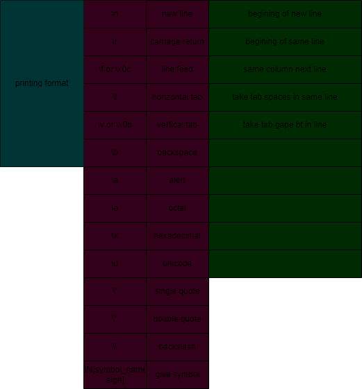

# Escape sequence
 
# Print variable value

    x=10
    print(x)

# Print multiple values

    x=10
    y=20
    print(x,y) //by default space separator thake

# Print multiple values with sep="ja diye sep korbo"

    x=10
    y=20
    print(x,y,sep=",")

# Print is like println of java

    x="mamun"
    y="MOLLA"
    print(x,y,sep="\n")

# End: TO KEEP VALUE CONSEQUTIVE WAY with end="ja diye sep korbo".line er sese ki hobe decide kore

    print("hello",end=".")
    print("Student",end="...")
    print("learn python")

# Sep and End together

    x=10
    y=20
    z=10
    print(x,y,z,end=".",sep=":")

# Formatted string

    print("format string %format_specifier" %(variable_name))

    format_specifier:
    a=int
    d=int
    f or F=float
    e or E= exponent
    g or G=give float bt point na thakle int kore
    s=int
    o=oct
    x=small hex
    X=capital hex
    O=error
    i=int
    c=char
    r=int
    u=int(non negative)

# Replacement operator

    x=10
    y=3.5
    z-"mamun"

    way-1:

    print("hello, {} x= {} y={}". format(z,x,y))
    print("hello, {0} x= {1} y={2}". format(z,x,y))

    way-2:

    print(f"hello, {z} x={x} y={y}")