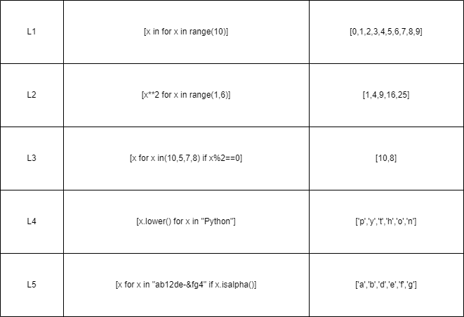
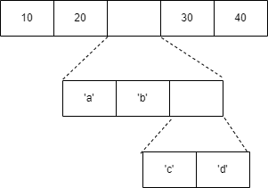

# List

- list are very similar to arrays

- they can contain any type of variable, and they can contain as many variable as you wish

- list can also be iterated over in a very simple manner

- it's a zero based index supporter & also support negative index

# Operation on lists
1. index operations [] 
    - access the value or modification
            
            1. access the value
                x=list_name[index]
            2. modify the value
                list_name[index]=new value
2. slicing operations
    - slicing is same as strings slice operations

            1. access the value
                list_name[start:end:step]
            2. modify the value
                list_name[start:end:step]=[values]
3. repititions operations
    
        list_name*int
        l=[1,2]
        m=l*3=[1,2,1,2]
4. memberships operations
    -same as string
        1. in operator
        2. not in operator

# Create list
- A list can be created in 2 ways that is
    1. by []

            list_name=[] (empty list)
            list_name=[10,20,30]
            list_name=["s","m"]
            list_name=[10,"d",3.5]

        
    2. by list()

            list_name=list((1,2,3))

# Add data in list

1. list_name.append(value) 
    - eta last a value add kore

2. list_name.insert(index,value) 
    - jodi index number a value boshate chai

3. list_name=list1+list2

4. list_name.extend(another iterable type)

5. new_list=list_name.copy()

# Remove data in list

1. list_name.remove(value)  
    - ekhane ek value multiple thakle 1st er ta remove hobe. remove kono value return kore na

2. list_name.pop(index) 
    - last value remove kore jodi index a kichu na dei. pop value return kore

3. list_name.clear() 
    - list k empty kore dey
4. del list_name[range or index]
    - slicing diye range akare mulitiple value delete kore 
    - index diye ekti value

# Iterating/ traversing a list
1. for loop
    -work as string
2. for loop using range
    -work as string
3. while loop
    -work as string

# List comprehensions
    
    list_name=[expression for item in iterable]

    
# List more functon

1.list_name.sort() 
    - choto theke boro dike sorting

2.list_name.reverse() 
    - list k reverse kore dey

3.list_name.index(value,start,end) 
    - value er index dekhay. ekadhik thakle 1st value er index dey jodi amra start,end a kichu na dei.

4.list_name.count(value) 
    - value koyber ache

# To know more function

        help(list_name)

# Nested list

- A list can have heterogeneous elements like int , float etc.
- A list can have a list as an element inside it this is called nested list for example
        
        Ex : list = [10, 20 [ ‘ a ’, ‘ b ’ [ ‘ c ’, ‘ d ’] , 30 , 40 ] ]
- Diagrammatically it can be represented as

- If you are having nested list you can prepare a matrix also with same type of values . Lets, see
this in a program

        a=[[1,2,3],[4,5,6],[7,8,9]]
        b=[[9,8,7],[6,5,4],[3,2,1]]
        c=[]
        for i in range(a):                      
            s=[]
            for j in range(len(a[0])):
                s.append(a[i][j]+b[i][j])
            c.append(s)
        

        output:[[10,10,10],[10,10,10],[10,10,10]]

        [# A, B are 2 list in which nested list residesOn this 2 list we are performing addition and appending the results in C and printing the result]
- Just like + you can also perform - , * on a matrix

