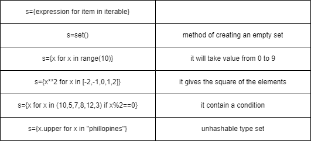

# Set datatype
- It is a collection of elements and it is iterable.

- it can contain any type of data that means it is heterogenous.

- But it is unordered . it don’t have indexing. In this, no duplicates are allowed.

- Indexing and slicing are not is allowed cause it
don’t have indexing.

## how to create set: 
- by using of lower bracket {}

        s={1,2,3}
- by using set()

        s=set(iterable)
## method of set
- Set is immutable you can modify or remove but we cant replace by using index that means it is growable.

        1. s.discard(value) // remove
        2. s.add(value) // add
        3. len(value) // length of set

## Set internals
- Lets see how hash table works internally

- We have 5 , 10 , 21 , 15 , 3 , 11

- It uses hash function which is x%10 ( its taking 10 because we have numbers between 0 to 10 )

- How this keys are stored in hash table lets see

            we take 5 . Take it in hash function
            h(x) = x%10
            h(5 ) = 5%10 = 5
            So it is stored hash table 5
            we take 10 .
            h(10) = 10%10 = 0
            So it is stored in the place of 0
            h(21) = 21%10 = 1
            h(11) = 11%10 = 1
            We got 1 for both 21 and 11 so both should be stored in 1 in hash table this is said as collision
            Then it is saved as a form of linked list
- Here we are taking mode 16

        h(10) = 10%16=10
        h(20) = 20%16=4
        h(30) = 30%16=14
        h(40) = 40%16=8
        h(50) = 50%16=2
        h(60) = 10%16=12
        h(70) = 20%16=6
        h(18) = 30%16=2
        h(31) = 40%16=15

## Set in Mathematics

1. Set

        s={1,2,3,4,5,6,7,8,9,10} # this is a set

        - A set in mathematics cannot have a duplicate value
2. Subset

        A={1,2,3,5,7}
        - Comparing elements of s with A . So it is having elements that are part of s.
        We say A is a subset of s
            A⊆s
        So A is part of s.

        B={5, 7, 9, 10}
            B⊆s
        B is also a subset of s

        c={1, 2, 3, 4, 5, 6, 7, 8, 9, 10}

        All elements are present in s
        c=s or c⊆s # we can call c equals to s or c is subset of s
3. Superset

        - Whenever we say A⊆s then s is superset for A
        - Whenever we say B⊆s then s is superset for B

4. Proper subset       

        - A proper subset means it should have some values from superset not all values
            D={1, 2, 3, 4, 5}
            E={6, 7, 8, 9, 10}
        What are common among themSo, there are no elements
        So, what would we call two subsets which are having no common elements.
        - We call them as disjoint sets.

## Set Methods
- Lets take an example
        
        A={1,2,3,5,7} B={5,7,9,10,11}
1. union(iterable)
    - It will generate a new set without duplicate
        
            A.union(B)
            // {1,2,3,5,7,9,10,11}
    
2. intersection(iterable)
    - It will print repeated one

            A.intersection(B)
            // {5,7}

3. difference(iterable)
    - It will print only A which is not presented in B.

            A.difference(B)
            {1,2,3}

4. Symmetric_difference(iterable)
    - It will not take the number present in both A and B

            A.symmetric_difference(B)
            {1,2,3,9,10,11}

5. intersection_update(iterable)
    - In intersection it will generate a new set but in difference update will update the list then A will become {5,7}
    - intersection(iterable )will generate a new set
    - update(iterable) will update in same string

6. difference_update(iterable)
    - work like intersection_update
7. symmetric_difference_update(iterable)
    - work like intersection_update
8. issubset(iterable)
    - check subset or not

            s.issubset(iterable)

            B.issubset(A) // check B is subset of A or not
9. issuperset(iterable)
     - check superset or not

            s.issuperset(iterable)

            B.issuperset(A) // check b is superset of A or not 
10. isdisjoint(iterable)
     - check disjointset or not

            s.isdisjoint(iterable)

## Set Operators
- The operators are given in the right hand side table
- Here we are taking the following sets and performing different set operators.

                s = { 1,2,3,4,5,6,7,8,9,10 }
                A = { 1,2,3,5,7 } B = { 5,7,9,10,11 }
- Union means combining both sets and removing duplicates

                C = A | B => A | B = { 1,2,3,5,7,9,10,11 }

                C - Taking result of A , B in var C
                | - pipe / union symbol
- Intersection means giving common elements

                C = A & B => A & B = { 5,7 }

                C - Taking result of A , B in var C
                & - Intersection symbol
- Difference of A - B means take all elements of A except those common in B
                
                C = A - B => A - B = { 1,2,3 }
- Symmetric Difference means take all elements of A and B except those common to both sets
                
                C = A ^ B => A ^ B = { 1,2,3,9,10,11}

                C - Taking result of A , B in var C
                ^ - Symmetric difference• Now let us check other operators.
- < , > are useful for checking proper subset (or) proper superset
- <= ,>= they consider equal sets as well while checking subset and superset
- == they check if two sets are equal or not
- != they check if two sets are not equal
- in , not in are also know as membership operators.They check if an element is present in a set or not and return boolean type as result.

Note :
- If you store the result of A | B in A, then the result will be go in A itself. So, You can write this as
                
                A | B ( same as A = A | B )
                A & B ( same as A = A & B )
                A - B ( same as A = A - B)

## More Set Methods
- Methods are the member function of a class
- Some of the built in methods of sets are add( ) , copy( ) ,update ( ) , pop( ) , discard( ) ,
remove( ) , clear( ).
- In a set if you want to add element you can do this with add(value) method.As sets are immutable we can add more values to a set.It will modify the same set ,add(value) only add one value not multiple value at a time.You can add any type of values in a set ( like str, int etc)

                s={1,2,3,4}
                s.add(5) //adding an element to a set

                output:{1,2,3,4,5}

- The copy( ) will give the same copy of a given set . It is also called cloning of a set.

                s={1,2,3,4}
                p=s.copy() //making clone of the original set

                p={1,2,3,4}
- If you want to add multiple values to a set then use update( iterable ) method.In update(iterable) it 1st checks the if value is available or not in the set if yes it doesn't add that value/ no duplicate and vice versa.

                s.update({6,7}) //when you want to add more than one element use update

                output:{1,2,3,4,5,6,7}
- Pop( ) will remove 1 element in a set, which element we don't know but it'll remove.

                s.pop() //pop( ) will not take argument , it will given an error if argument given.

- In discard ( x ) you have to mention the element which you want to remove.There is no index available in set so you have to mention the element to be discarded.

                s.discard(5) // discard ignore if no element is found to be discarded
- The remove( x) method , removes the element from the set, work same as discard( x ) the only difference is discussed below in the example.

                s.remove(6) //Remove gives an error when no element is found to be removed.
- The clear( ) method , will clear all contents of set, it will make it as an empty set.

                s.clear() // empty set

## Set Comprehension

