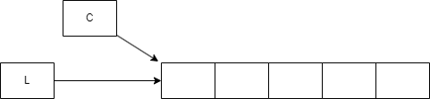
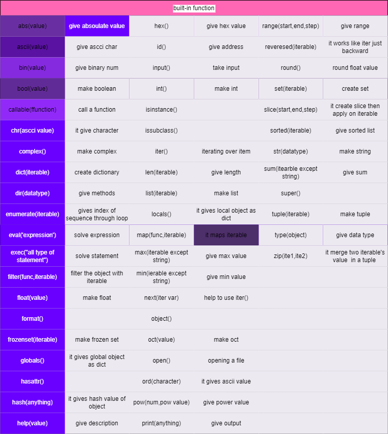

# Functions
- A function is a piece of code which performs a specific task

- It is used to reduce the repetition of the code hence reducing the size of the code, Less chances of making mistakes in the code

- Functions make the task easy for the programmers as each programmer in a team can be given a specific task( function ) and at the end we can combine these task together to make single application.
## Some points to remember are :
- Program is a general term
- A very big program is called application
- An application broke into pieces are called modules that performs a specific
task
- Modules broken into pieces are called Functions / Procedure
## Advantages :
- Easy development
- Error free
- Can be developed by a team of programmers
- Reuse modules for function in other projects
## Creating a Function :
### Syntax : 
    def Name ( <parameter List >):
        ……….
        ……….
        ……….
        return result
- A function must return a result and it python it returns result
-  If you don’t write return inside a function then it’ll automatically returns None

## How to write a function
- We can write a function by using the keyword def followed by a function name.

- The function name is user define and it is suggested to take a meaningful name while defining
a function

- The rules for defining a function is same as giving variable names

- Within the ( ) you can pass parameters to a function these Parameter are called “Formal
parameter”

- Parameters are called input to a function , a function can take multiple Parameter.

- Parameters can be of any datatype

- Returning values of the statements is Called “output”

- You can call a function by using the function name and pass parameter in ( ) , these Parameter
are called “Actual parameter”

- The actual parameter values are copied into formal parameter which acts as input to a
function they are copied in the same position / order

- When you call a functioning a result is returned you should place that result into another
variable (or) print it directly

- If you don’t write return in function it'll return NONE

- So, every function returns whether you write it or not.
### Syntax :
    def fun_name ( par1 , par2, par3 ) : //Formal parameter
        Stat1
        Stat2
        ……          //Statements of function
        ……
        return result   //#Returning result
    fun_name ( par1, par2, par3 )   //Calling a function
    return_value = fun_name ( apar1, apar2, apar3 ) //Calling a function
- A simple example to understand function.

        def add3(a,b,c):
            r=a+b+c
            return r
        print(add3(10,15,5))
        r=add3(1,3,5)
        print(r)

        Output :
            30
            9
- The values in formal parameter acts as a pointer to actual parameter
- therefore they'll be referring to the same thing
- Lets understand this with an

        def add3(a,b,c):
            print("inside function",id(a),id(b),id(c))
        x,y,z=10,15,5
        print("outside function",id(x),id(y),id(z))
        print(add3(x,y,z))
        
        Output:
            outside function 444676... 444676.... 444676...
            inside function 444676... 444676.... 44676...
            None
- In python object are always pass just like reference only , copy of an object will never be pass

## Positional vs keyword Arguments
    1. Def net_sal(basic, allowance, deduction): // for calculating net sal of an employee.
        net=basic +allowance_deduction
        Return net
       n= net_sal(8000, 6000,2000) // way to call function for net sal
                 Actual parameters

    Basic allowance deduction
    8000   6000     2000
    Actual parameters can be copied

    2. Def net_sal(basic, allowance, deduction): // function for net sal
        net= basic+allowance-deduction
        Return net
       n=net_sal(basic, allowance, deduction)
       print(‘Net salary is:, n’)
    
    To know which variable has print which value.Output:
        Net salary is : 12000
    
    // so this is called as positional arguments

- By writing the names of parameters also we can call the function.
- These are called as keyword argument. Without that it is a positional argument

        def net_sal(basic,allowance,deduction):
            print("basic",basic)
            print("allowance",allowance)
            print("deduction",deduction)
            net=basic+allowance-deduction
            return net
        n=net_sal(deduction=2000,allowance=6000,basic=8000)
        print("net salary is:",n)
- both positional and keyword arguement

        def net_sal(basic,allowance,deduction):
            print("basic",basic)
            print("allowance",allowance)
            print("deduction",deduction)
            net=basic+allowance-deduction
            return net
        n=net_sal(8000,deduction=2000,allowance=6000)
        print("net salary is:",n)

## Default Argument
- Default should be on right side
- keyword should be in right
- We can make argument default or optional

        def add ( a,b,c ):
            return a+b+c
        print( add(10,5,2)) //ok
        print( add(10,5)) //error
        print( add(10)) // error
- Can we pass different number of parameter ???? Yes we can pass
        
        def add( a , b=0 , c=0):
            return a+b+c
        add ( 5,7)
    - It will take a as 5 and b=7 and c as 0
    - Here two cases are default
            
            add(a=10,b=5,c=2) //ok
            add(b=5,c=2,10) // error
- Default are created only once
    
        def addition ( item,L =[ ]):
            L.append(item)
            return L
    

# Recursive function

- A function calling itself is called recursive function

- It is same as the recursive function in mathematics

- A factorial is defined in terms of factorial only ,therefore it is called recursive function

- Ex : 
    
        n ! = 1 * 2 * 3 * 4 * 5 ….. * n
    
        5! = 5 * 4 * 3 * 2 * 1
    
        5! = 5 * 4!
    
        n! = n * ( n -1)!

- In maths recursive function is also define as
    
        fact( n ) = 1 if n=0 
                    n*fact(n-1) if n>0

- In python we can write the same thing as

- Ex:
        
      
        
        def fact ( n ) :
            If n == 0 :
        
                return 1
        
            else :
        
                Return n * fact ( n-1)
        
        r=fact(5)
        print(r)
        
        Output : 120

# built-in function

- filter(func,iterable)

        eg.

        l=[1,2,3,6,4,5,9,7,8,10]
        def even(num):
            if num%2==0:
                return True
            else:
                return False
        
        print(filter(even,l)) //give object address\
        f=filter(even,l)
        for i in f:
            print(i)
        
        output:2,6,4,8,10

        eg.

        f=filter(lambda x:x>5,l)
        for i in f:
            print(i)
        
        output:6,7,8,9,10

- iter(iterable)

        eg.

        l=[1,2,3,5]
        it=iter(l)
        print(next(it)) //1
        print(next(it)) //2
        print(next(it)) //3
        print(next(it)) //5

- map(func,iterable): it maps the other sequence

        eg.
        l=[1,2,3]
        m=map(lambda x:x**2,l)//[1,4,9]

- slice(s,e,s)

        eg.
        l=[1,2,3,4,5]
        s=slice(2,4)
        print(l(s))//[3,4]

# module

- A module can contain predefined variable , functions , classes and we use this things in different programs with the help of import

- Modules are nothing but python files . Normal programs can be modules
too

- Lets save a program as ModuleOne

        total_amount=2000
        def add(x,y):
            return x+y
        def sub(x,y):
            return x-y

- And a program as MyProgram

        import ModuleOne as mo

        n1=10
        n2=20
        print("sum",mo.add(n1,n2))
        print("diff,mo.sub(n2-n1))
        print(mo.total_amount)

- In program ModuleOne we are defining the function and in program Myprogram we are calling the function ( add , sub )
- What happens if we write print function in ModuleOne program??
- it will print that function in MyProgram output
- If we want to execute only MyProgram.py but not ModuleOne.py(add and subtract ) print function
- For this we can ass print (__name__)
- It means the printing should be done only if its in main . If it is importing then don’t execute the print function
- We can also write

        if __name__=='__main__':
            print(__name__)
            print("from module one",add(20,30))
            print("from module one",sub(50,10))

# function as object

- syntex

        var=funcName
        var()
- eg.

        def display():
            print("hello")
        
        d=display
        d()

# nested function
- a func inside a func
- syntex

        def outerfunc():
            def inner():
                //do s
            
            inner()
        outerfunc()

# function as parameter
- syntex

        def fun1():
            //do something
        
        def func(f):
            f()
        func(fun1)
- eg.

        def add(x,y):
            print(x+y)
        def sub(x,y):
            print(x-y)
        
        def fun(f,x,y):
            f(x,y)
        fun(add,15,10)
        fun(sub,15,10)

# function returning a function

- syntex

        def outer():
            def inner():
                //do something
            return inner
        d=outer()
        d()

# closure function
- nested function
- accessing non-local variables
- return nested function
- caller classes
- eg.

        def closure():
            msg="hello"
            def display():
                print(msg)
            return display
        
        d=closure()
        s=d()
        print(s)

# Lambda function
- anonymous function
- single line expression
- any number of arguments
- syntex

        lambda arguement: expression
- eg.

        // normal function

        def milesToKm(miles):
            kms=1.6*miles
            return kms
        print(milesToKm(10))

        // lambda function

        k=lambda miles: 1.6*miles
        print(k(10))